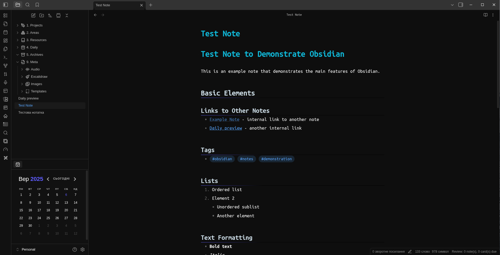
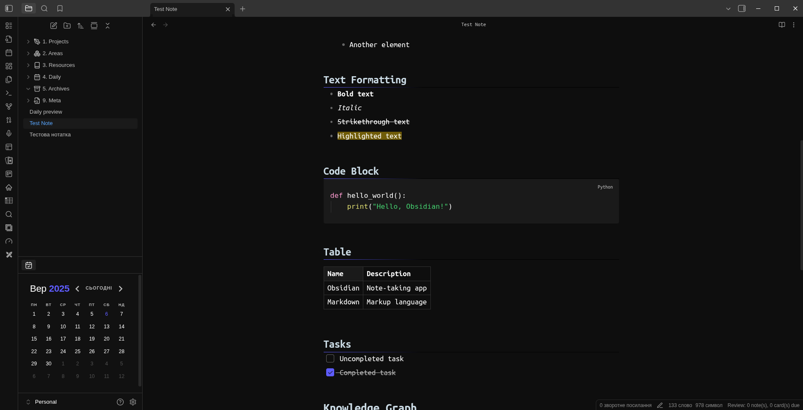

Noctilux - Dark minimalist theme 

## Preview




### Manual Installation
1. In command line:
```bash
cd .obsidian/themes
git clone https://github.com/santiyounger/Wasp-Obsidian-Theme.git
```
3. In Settings → Appearance → Themes select "Noctilux"
